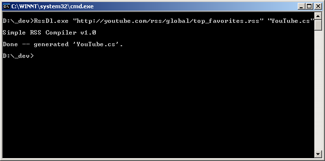
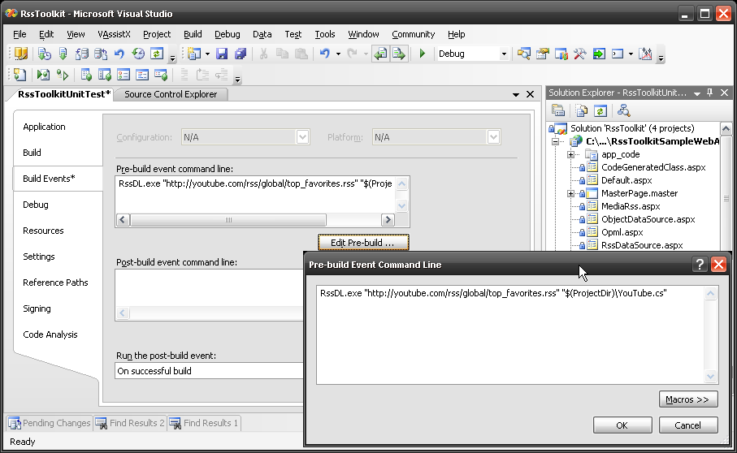

The command-line compiler takes an feed URL or the file name of an existing feed and generates a class file in either VB.Net or C#. The command line is quite simple:
* {{ RssDl.exe "URL" "OutputFile" }}
	* The _URL_ will be read and the format of the feed determined, this includes automatically sensing if this is an RSS/Atom/RDF or OPML feed, and also the format (properties) of the feed items.
	* The _OutputFile_ extension determines the language of the generated class (e.g. .vb will generate VB.Net code and .cs will generate C# code)
* Some examples:
	* {{RssDl.exe “http://news.google.com/?output=rss” GoogleNews.vb}}
	* {{RssDl.exe “http://youtube.com/rss/global/top_favorites.rss” YouTube.cs}}
As a walkthrough, here's the process of using {{RssDl.exe}} to cosume YouTube's top favorites feed:
* Run the compiler _{{ RssDl.exe “http://youtube.com/rss/global/top_favorites.rss” YouTube.cs }}_ 
* Open the generated file {{YouTube.cs}} in you project and examine the strong-typed properties:
{{
    [XmlElement("player", Namespace="http://search.yahoo.com/mrss/")](XmlElement(_player_,-Namespace=_http___search.yahoo.com_mrss__))
    public YoutubePlayer Player {
        get {
            return _player;
        }
        set {
            _player = value;
        }
    }
    
    [XmlElement("thumbnail", Namespace="http://search.yahoo.com/mrss/")](XmlElement(_thumbnail_,-Namespace=_http___search.yahoo.com_mrss__))
    public YoutubeThumbnail Thumbnail {
        get {
            return _thumbnail;
        }
        set {
            _thumbnail = value;
        }
    }
    
    [XmlElement("category", Namespace="http://search.yahoo.com/mrss/")](XmlElement(_category_,-Namespace=_http___search.yahoo.com_mrss__))
    public YoutubeCategory Category {
        get {
            return _category;
        }
        set {
            _category = value;
        }
    }
    
    [XmlElement("credit", Namespace="http://search.yahoo.com/mrss/")](XmlElement(_credit_,-Namespace=_http___search.yahoo.com_mrss__))
    public string Credit {
        get {
            return _credit;
        }
        set {
            _credit = value;
        }
    }
}}
* Add the generated file to your {{App_Code}} directory (for a Web Site Project) or include in your project (for a class library or Web Application Project).  Now you can use the class just like an {{RssDocument}} (it derives from there), plus it has all the strong-typed properties for the feed items.
* Add code to grab the actual feed from the generated class and bind to the {{Items}} property.
{{
<html xmlns="http://www.w3.org/1999/xhtml">
<head runat="server">
    <title>YouTube Media Rss</title>
    
</head>
<body>
    You Tube Top Favories(Media Rss)
    <form id="form1" runat="server">
        <asp:DataList ID="DataList1" runat="server" RepeatColumns="3" GridLines="both">
            <ItemTemplate>
                <asp:Image ID="Image1" runat="Server" ImageUrl='<%# Eval("Thumbnail.Url")  %>' /> 
                 <asp:HyperLink ID="HyperLink1" NavigateUrl='<%# Eval("Player.Url") %>' Text='Link' runat="server" />
            </ItemTemplate>
        </asp:DataList>
    </form>
</body>
</html>
}}
* Run the page and enjoy the view 

Note that you can automate the process of executing the {{RssDl.exe}} compiler by placing it in a _Build Events / Pre-build event command line_ to insure that the generated source file matched the current feed. Of course this could lead to compilation errors, but that's the whole point of doing strong-typed classes. 