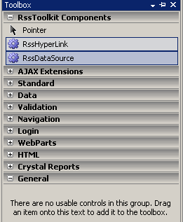
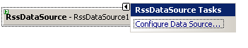
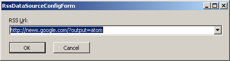
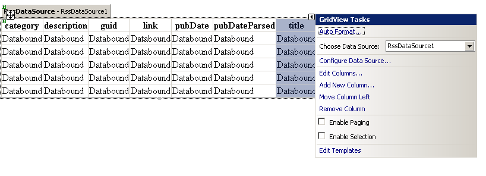
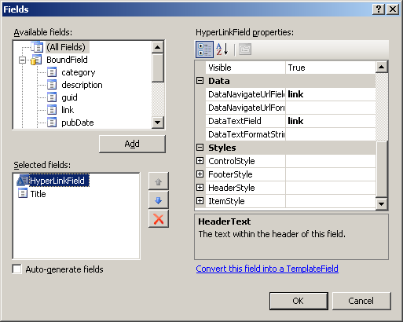

Here are the steps you can take to use **RssDataSource** in your page or user control:
* Add the **RssDataSource** and **RssHyperLink** to the Toolbox in Visual Studio (once). 
* In your Web form, drop the **RssDataSource**.
* Click the control and “Configure Data Source” 
* Enter the feed URL. _{"[source code note: The RssDataSourceConfigForm.cs is what is being displayed](source-code-note_-The-RssDataSourceConfigForm.cs-is-what-is-being-displayed)"}_
	* You can provide RSS/Atom/RDF or OPML feed URL and **RssDataSource** will automatically identify the feed type and provide data-binding capability.
	* Here an ATOM feed URL is being used:  
* You can then bind a control like {{GridView}} to this {{DataSource}}. 
* Next, using the _Edit Columns..._ dialog you can select the columns to be displayed. 
* In the page markup, you can change the number of items that should be returned from the {{DataSource}}
{{
<%@ Page Language="C#" AutoEventWireup="true" CodeFile="Default2.aspx.cs" Inherits="Default2" %>
<%@ Register Assembly="RssToolkit" Namespace="RssToolkit.Web.WebControls" TagPrefix="ast" %>
<!DOCTYPE html PUBLIC "-//W3C//DTD XHTML 1.0 Transitional//EN" "http://www.w3.org/TR/xhtml1/DTD/xhtml1-transitional.dtd">
<html xmlns="http://www.w3.org/1999/xhtml" >
<head runat="server">
    <title>Consuming Google News using RssToolkit</title>
</head>
<body>
    Google News (Atom Format)
    <form id="form1" runat="server">
       <ast:RssDataSource id="RssDataSource1" runat="server" maxitems="5" url="http://news.google.com/?output=atom"></ast:RssDataSource>
       <asp:GridView ID="GridView1" runat="server" AutoGenerateColumns="False" DataSourceID="RssDataSource1">
          <Columns>
             <asp:HyperLinkField DataNavigateUrlFields="link" DataTextField="link" HeaderText="Link"/>
             <asp:BoundField DataField="title" HeaderText="Title" SortExpression="title" />
          </Columns>
       </asp:GridView>
    </form>
</body>
</html>
}}
* Run the page and enjoy the view 
