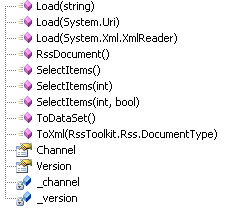

There are several ways to load and manipulate a feed.


* {{Load}} – takes 3 overloads taking either a {{System.Uri}}, a {{String}} containg the feed's XML, or an {{XmlReader}}. You can provide RSS/Atom/RDF or OPML formatted feeds for any of these 3 overloads and it will automatically identify the base feed type and construct the class appropriately.
* {{SelectItems}} – returns an {{IEnumerable}} which can be gives the ability to iterate over the collection. It is also used internally to provide data binding capability to **RssDataSource**.
* {{ToXml}} – returns a {{String}} with the Xml of the feed in any supported format for publishing the feed . The input parameter {(enum DocumentType}} specifies the format of Xml returned as RSS/Atom/RDF or OPML.
* {{ToDataSet}} – returns the feed contents as a {{DataSet}}. This is useful to directly assign to a data-bound control.
An example of using **{{RssDocument}}** directly to bind to a {{GridView}}:
{{
void Page_Load(object sender, EventArgs e)
{
    RssToolkit.Rss.RssDocument rss = RssToolkit.Rss.RssDocument.Load(new System.Uri("http://rss.msnbc.msn.com/id/3032091/device/rss/rss.xml"));
    Image1.ImageUrl = rss.Channel.Image.Url;
    GridView1.DataSource = rss.SelectItems();
    GridView1.DataBind();
}
}}