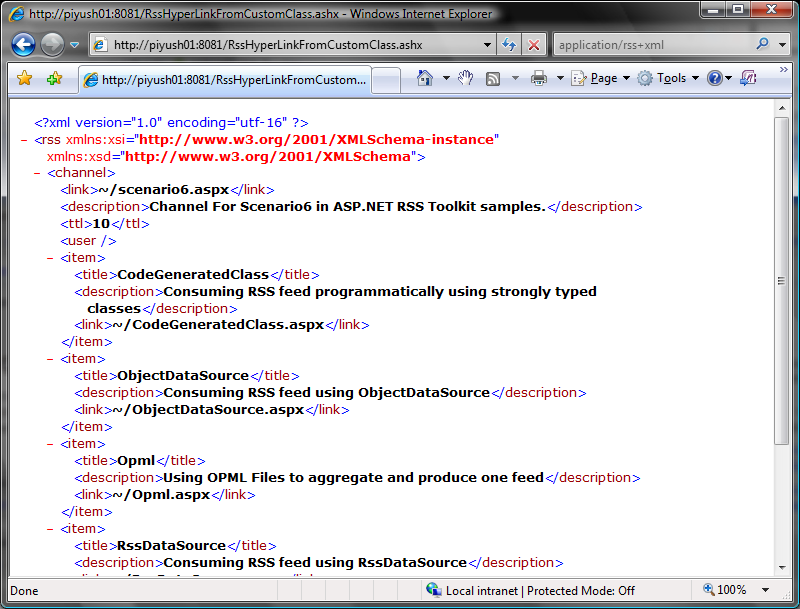

## Using an ASHX handler to publish a feed

When using the ASP.Net Build Provider mechanism, the RssToolkit will automatically detect certain files created or modified in the filesystem. It automatically generates strong-typed classes for those files and compiles the code. This occurs for any files with the extension configured in the {{web.confg}} file (typically {{.rss}} and {{.rssdl}}).  This class library is used to consume a feed as documented in [Consuming Feeds with a Build Provider](Consuming-Feeds-with-a-Build-Provider). In addition, the RssToolkit also generates an {{HttpHandler}} derived class which you can use as a base-class from which you can then inherit from to create code that publishes your feed.

In the samples provided. The {{App_Code}} folder has {{Sample5.Rss}} file that defines a custom feed's contents:
{{
<?xml version="1.0" encoding="utf-8"?>
<rss version="2.0">
    <channel>
        <title>Sample Channel</title>
        <link>~/RssHyperlinkFromCustomClass.aspx</link>
        <description>Channel For Scenario5 in ASP.NET RSS Toolkit samples.</description>
        <ttl>10</ttl>
        <name></name>
        <user></user>
        <pubDate>Tue, 10 Apr 2007 23:01:10 GMT</pubDate>
        <lastBuildDate>Tue, 10 Apr 2007 23:01:10 GMT</lastBuildDate>
        <webMaster>webmaster@email.com</webMaster>
        <item>
            <title></title>
            <description></description>
            <link></link>
        </item>
        <item>
            <title></title>
            <description></description>
            <link></link>
        </item>
    </channel>
</rss>
}}
When the file is created or modified RssToolkit's Build Provider automatically generates code and compiles it based on the schema of this file. It prefixes all the generated classes with _Sample5_. So like the weak-typed {{RssDocument}} there will be a parallel {{Sample5Rss}} class; {{RssChannel}} will have a parallel {{Sample5Channel}} class; and {{RssItem}} will have a parallel {{Sample5Item}} class. The classes can be used to build up  the contents of the feed in a strong-typed way from whatever datasource defines the feed contents. Indeed, the feed contents could be loaded from any compliant place, including a file or a fetch from a foreign URL that the client cannot access.

The Build Provider **also** creates a default {{HttpHandler}} derived class called {{Sample5HtppHandlerBase}} which inherits from {{RssHttpHandlerBase}}. You can then create a custom {{.ashx}} {{HttpHandler}} which inherits from the {{Sample5HttpHandlerBase}} class and in the code-behind for that page you simply build up the contents of the feed.
{{
<%@ WebHandler Language="C#" Class="RssHyperLinkFromCustomClass" %>

using System;
using System.Collections.Generic;
using System.Web;
using RssToolkit.Rss;

public class RssHyperLinkFromCustomClass: Sample5HttpHandlerBase
{
    protected override void PopulateRss(string rssName, string userName)
    {
        Rss.Channel = new Sample5Channel();
        
        Rss.Channel.Items = new List<Sample5Item>();
        if (!string.IsNullOrEmpty(rssName))
        {
            Rss.Channel.Title += " '" + rssName + "'";
        }

        if (!string.IsNullOrEmpty(userName))
        {
            Rss.Channel.Title += " (generated for " + userName + ")";
        }

        Rss.Channel.Link = "~/scenario6.aspx";
        Rss.Channel.Description = "Channel For Scenario6 in ASP.NET RSS Toolkit samples.";
        Rss.Channel.Ttl = "10";
        Rss.Channel.User = userName;

        Sample5Item item = new Sample5Item();
        item.Title = "CodeGeneratedClass";
        item.Description = "Consuming RSS feed programmatically using strongly typed classes";
        item.Link = "~/CodeGeneratedClass.aspx";
        Rss.Channel.Items.Add(item);

        item = new Sample5Item();
        item.Title = "ObjectDataSource";
        item.Description = "Consuming RSS feed using ObjectDataSource";
        item.Link = "~/ObjectDataSource.aspx";
        Rss.Channel.Items.Add(item);
    }    
}
}}
When you navigate to this handler, the document (in RSS format) would look like this:
