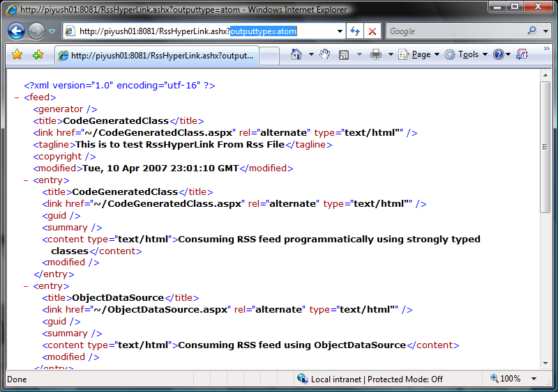

## Publishing a feed using {{RssDocument.ToXML}}
The weak-typed {{RssDocument}} class, as well as the strong-typed classed generated by the {{RssDll.exe}} command link compiler or the Build Provider include a {{ToXml}} method, which can be used to serialize and publish the feed:
{{
public string ToXml(DocumentType outputType);
}}
This method accepts a {{enum DocumentType}} argument that specifies what format the emitted XML should have. The options are listed:
{{
    Rss,
    Opml,
    Atom,
    Rdf
}}
To publish your feed as an Atom format feed from {{RssDocument}}, you can do the following inside an ASP.Net {{HttpModule}} or an {{HttpHandler}}:
{{ 
string outputXml = rssDocument.ToXml(DocumentType.Atom); // Publish as Atom
XmlDocument document = new XmlDocument();
document.LoadXml(outputXml);
context.Response.ContentType = "text/xml";
document.Save(HttpContent.Current.Response.OutputStream);
}}
As seen in the above sample code, you can decide the format of the output feed from the query-string. The default {{HttpHandler}} uses the _outputtype_ query-string parameter and the values can be _rss_, _rdf_, _atom_ or _opml_ for the respective feed formats.

A sample of the feed emitted by the code above is shown here:
