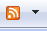

## The {{RssHyperLink}} control 
This control lets you emit an HTML  suitable for inclusion in the  element of a page. When this is done, you enable autodiscovery of feeds related to the page as well as easy subscription. When a browser link Internet Explorer 7 discovers a link like this, it will show the presence to the user with this icon  on the toolbar.
The emitted link looks like this:
{{
<link rel="alternate" type="application/rss+xml" title="Rss" href="~/RssHyperLink.ashx" />
}}
You can use {{RssHyperLink}} to point to where the feed is provided like this:
{{
<head>
   <title>Sample page with autodiscovery links</title>
   <art:RssHyperLink ID="myRss" runat="server" IncludeUserName="True" NavigateUrl="~/RssHyperLinkFromCustomClass.ashx">RSS</art:RssHyperLink>
   <art:RssHyperLink ID="myAtom" runat="server" IncludeUserName="True" NavigateUrl="~/RssHyperLinkFromCustomClass.ashx?outputtype=atom">Atom</art:RssHyperLink>
<head>
}}
Notice that you can have as many links as you like in a single page, each can point to a different feed, or a different format for the same feed.
The {{RssHyperLink}} control has the following attributes in addition to those inherited from the standard {{Hyperlink}} control:
* _ChannelName_ – Will be automatically appended to the query-string of the _NavigateUrl_ to indicate a specific channel of a feed. The query-string parameter will look like this {{?c=XXX}} where _XXX_ is the _ChannelName_ value.
* _IncludeUserName_ – If true, this will append an authentication ticket representation to the query-string of the _NavigateUrl_ to pass a {{FormsAuthenticationTicket}} along with the feed request. This allows a previously authenticated user to fetch a secured feed. The query-string parameter will look like this {{?t=YYY}} where _YYY_ is the Encrypted, Base64 encoded version of a FormsAuthenticationTicket.
When setting the _IncludeUserName_ attribute true,  this does NOT require a cookie, nor does this actually re-login the user. It merely passes the information necessary to (in code) handle the secure passing of the username when the feed is requested. The {{RssHttpHandlerBase}} class uses this to automatically pass the user name on to the feed population.